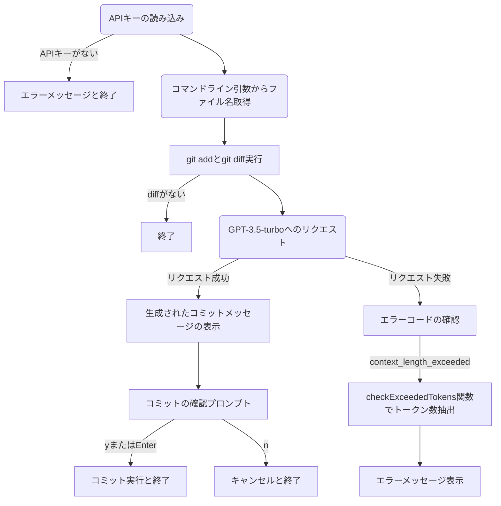

# ai-commit

git diff の出力からコミットメッセージを生成するプログラムです。

## 使い方

1. GitHubからコードを取得します。

```
git clone https://github.com/kou72/ai-commit.git
```

2. ディレクトリに移動し、必要なモジュールをインストールします。

```
cd ai-commit
npm install
```

3. `npm link` コマンドで、ローカル環境で実行できるようにします。
  - 💡`npm link` は、現在のパッケージ（プロジェクト）を、グローバルにインストールされたパッケージのように扱うためのコマンドです。これにより、開発中のパッケージを他のプロジェクトやシステム全体で簡単に利用できるようになります。

```
npm link
```

💡`npm link` は、現在のパッケージ（プロジェクト）を、グローバルにインストールされたパッケージのように扱うためのコマンドです。これにより、開発中のパッケージを他のプロジェクトやシステム全体で簡単に利用できるようになります。

4. OpenAIの管理画面 (https://platform.openai.com/account/api-keys) からAPIキーを取得します。

5. 環境変数 `AI_COMMIT_KEY` に、取得したOpenAIのAPIキーを設定します。

<details>
<summary>Bashの場合</summary>

環境変数を一時的に設定するには以下のコマンドを実行します。

```
export AI_COMMIT_KEY="your_api_key_here"
```

環境変数を永続的に設定するには、`~/.bashrc`（Linux）または`~/.bash_profile`（macOS）に次の行を追加してください：

```bash
export AI_COMMIT_KEY="your_api_key_here"
```

ファイルを編集した後、設定を適用するには、新しいターミナルウィンドウを開くか、以下のコマンドを実行してください：

```bash
source ~/.bashrc
```

または

```bash
source ~/.bash_profile
```
---

</details>

<details>
<summary>PowerShellの場合</summary>

環境変数を一時的に設定するには以下のコマンドを実行します。

```
$env:AI_COMMIT_KEY = "your_api_key_here"
```

環境変数を永続的に設定するには、次のコマンドを使用してください

```
[System.Environment]::SetEnvironmentVariable("AI_COMMIT_KEY", "your_api_key_here", "User")
```

この設定を適用するには、PowerShellを再起動する必要があります。

</details>

<details>
<summary>WindowsのGUIを使用する場合</summary>

WindowsでGUIを使用して環境変数を設定する方法は以下の通りです：

1. コントロールパネルを開きます。これは、スタートメニューの検索ボックスに「コントロールパネル」と入力することでアクセスできます。

2. コントロールパネルの「システムとセキュリティ」カテゴリをクリックし、「システム」を選択します。

3. 「システム」ウィンドウで、「システムの詳細設定」をクリックします。

4. 「システムのプロパティ」ダイアログが表示されます。「詳細設定」タブを選択し、「環境変数」ボタンをクリックします。

5. 「環境変数」ダイアログが表示されます。ここで、環境変数をユーザー固有のものか、システム全体のものかを選択できます。通常は、「ユーザー環境変数」のセクションに新しい変数を追加します。このセクションで、「新規(N)」ボタンをクリックします。

6. 「新しいユーザー環境変数」ダイアログが表示されます。「変数名」に`AI_COMMIT_KEY`と入力し、「変数値」にOpenAIのAPIキーを入力して、「OK」をクリックします。

7. 「環境変数」ダイアログと「システムのプロパティ」ダイアログで「OK」をクリックして設定を保存し、ダイアログを閉じます。

この設定を適用するには、PowerShellを再起動する必要があります。

</details>

6. Gitが適用されているディレクトリで、`ai-commit`コマンドを実行します。

```
ai-commit
```

または、特定のファイルに対してコミットメッセージを生成する場合はファイル名を指定します

```
ai-commit file_name.js
```
## 処理フロー

